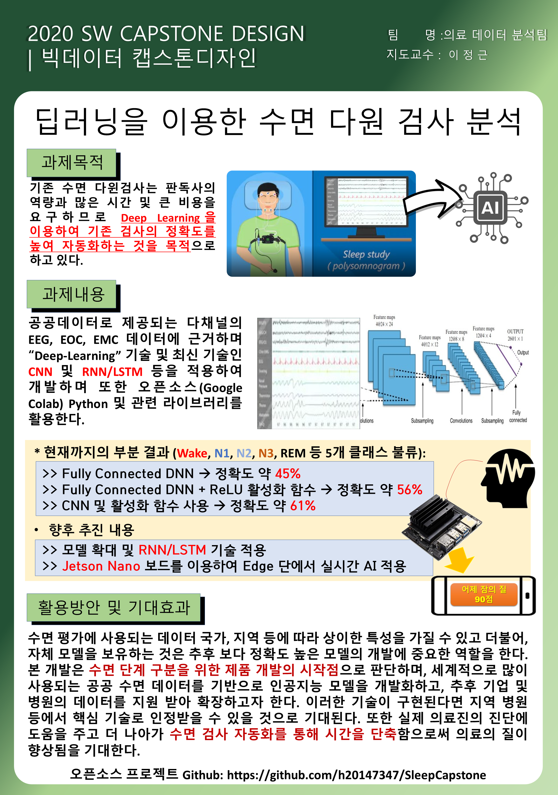
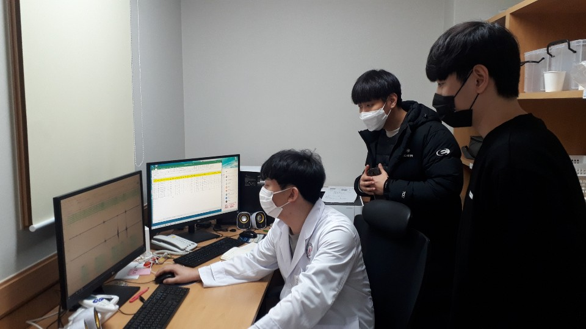
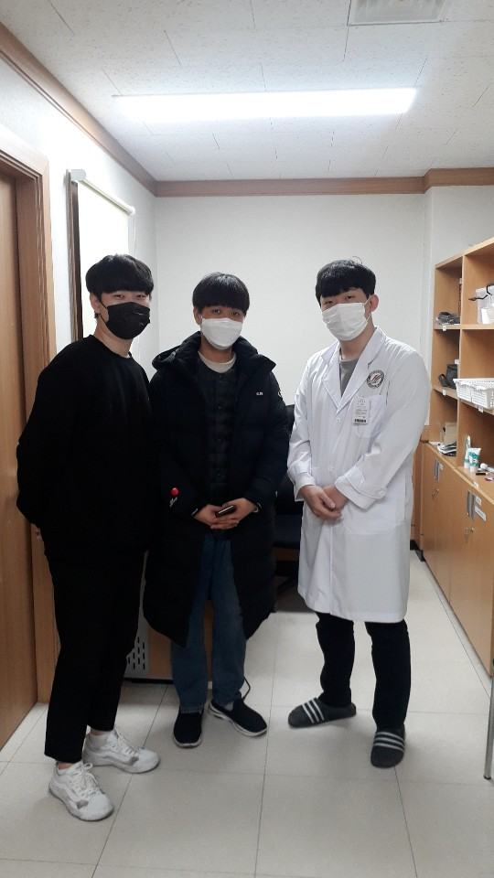
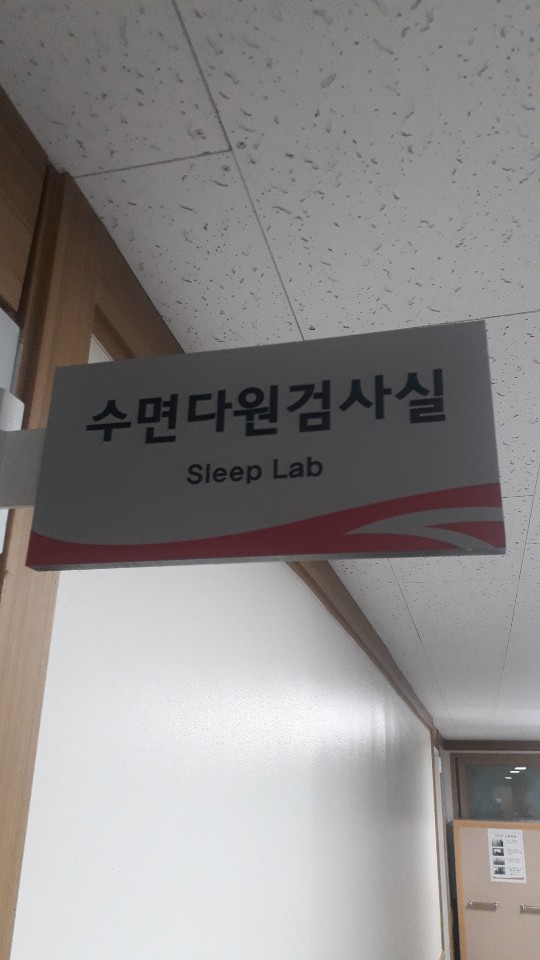

## 2020 가을 학기 빅데이터 캡스톤 (한림대학교 소프트웨어융합대학)
## Deep Learning Based Sleep Stage Classification
## (딥러닝을 이용한 수면 평가 캡스톤)

### 참여자
   - 이명수 (팀장)
   - 오석준
   - 이현민
   - 정승용
   
### 지도교수 / 멘토
   - 지도교수: 이정근 (한림대 소프트웨어융합대학)
   - 멘토: 김동영 (한림대 컴퓨터공학과 대학원생)
   
   - 자문교수: 김동규 (한림대 성심병원 이비인후과)
   
### 과제 개요
   - 딥러닝을 이용한 수면 단계 예측
   
### 진행 사항
   - 9월 4일: Kick off meeting - 멤버간 인사 및 과제 개요 공유
      - 과제: 수면 검사란 무엇인지 공부하기!
   
   - 9월 11일: 데이터 활용 지도 및 공유
   
   - 9월 18일: 논문 발표

   - 9월 25일: 1차 데이터 준비 : Colab에서 Jupyter Note 구성
   
   - 10월 8일: 2차 데이터 준비/완료: Colab에서 공공데이터 준비 및 Simple Classification [Codes](https://github.com/jeonggunlee/SleepCapstone/tree/master/Codes)
   
   - 10월 15일: 모델에 대한 토의 및 실험 결과 공유
   
   - 10월 22일: Big Data Capstone 중간 발표회 포스터 제작 및 토의
      - 

   - 10월 29일 - 11월 19일: 모델에 대한 토의 및 실험 결과 공유
   
   - 11월 25일: 한림대 성심병원 수면다원평가실 방문 및 협의
      - 
      - 
      - 
      

### 좋은 자료
   - [자료 1: Spindle 검출 알고리즘 등등](https://raphaelvallat.com/)

